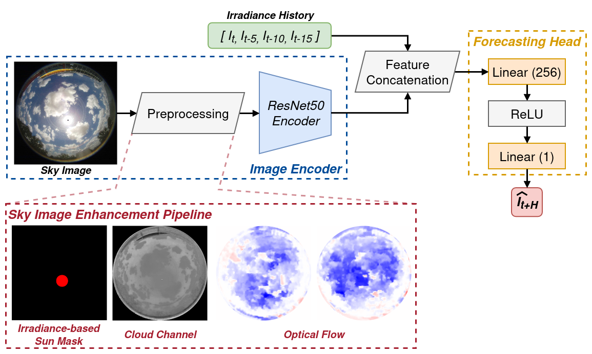
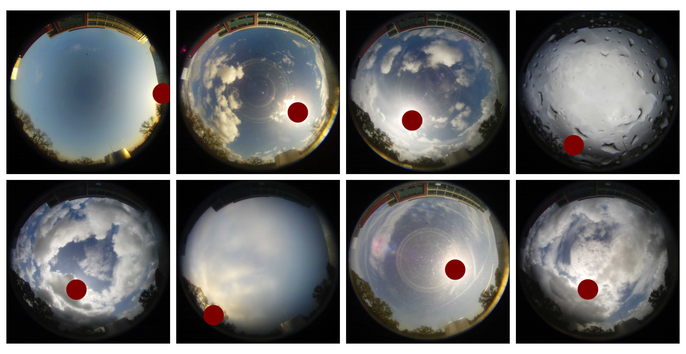
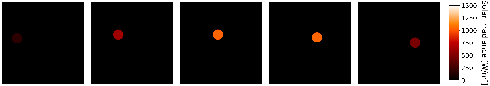
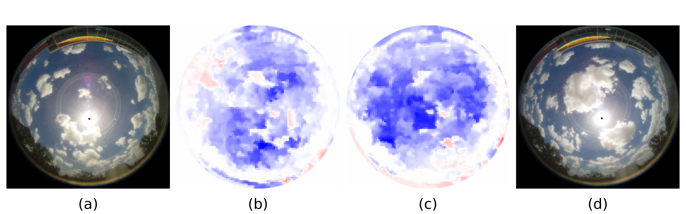
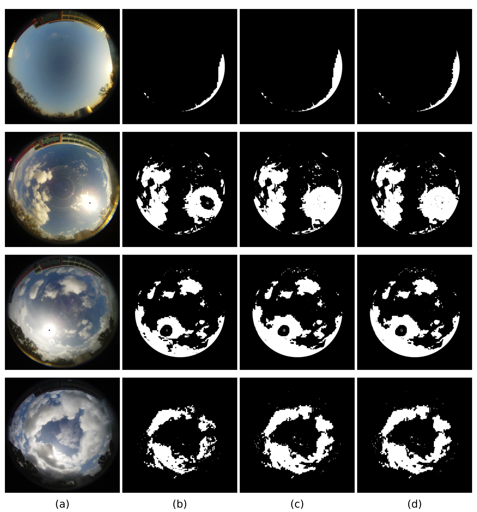
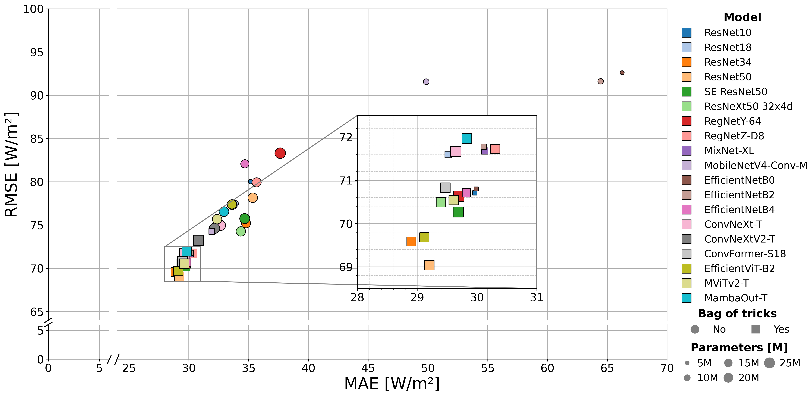
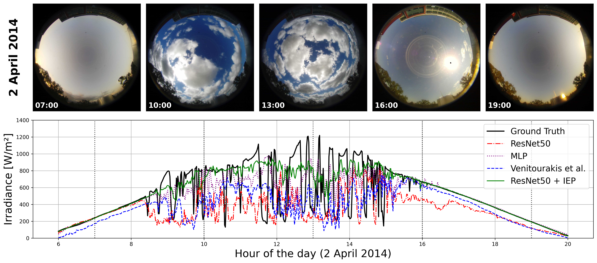
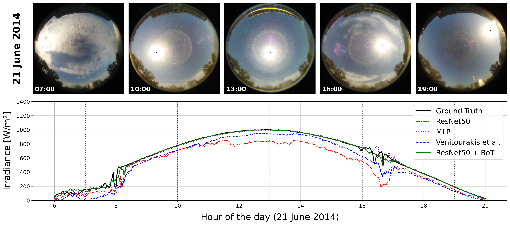
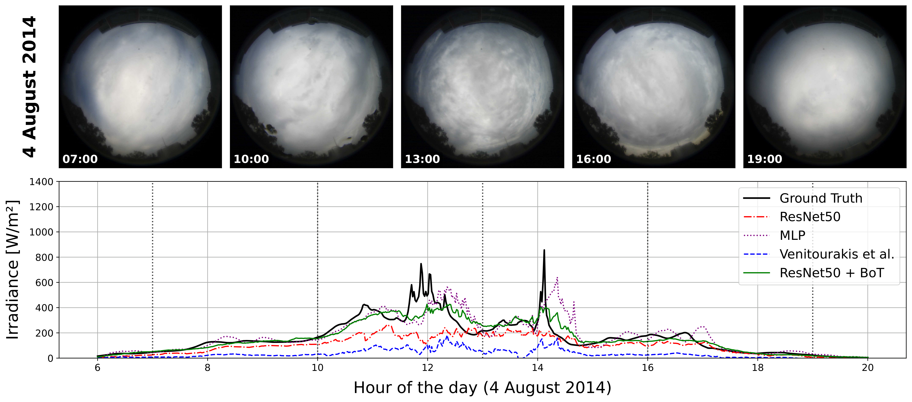

# A systematic synthesis of sky image enhancement techniques for ground-based solar irradiance forecasting

[](https://doi.org/10.5281/zenodo.15792283)


> A systematic synthesis of sky image enhancement techniques for ground-based solar irradiance forecasting.

## Table of Contents
* [Overview](#overview)
* [Requirements](#requirements)
* [Sky image enhancement methods](#sky-image-enhancement-methods)
* [Dataset](#dataset)
* [Usage](#usage)
* [Results](#results)
* [Citation](#citation)

## Overview

<p align="center">
     
</p>

## Requirements

* Python *3.12.6*
* Python packages defined in the *[pyproject.toml](./pyproject.toml)* file

```bash
pip install -e .[dev]
```

## Sky image enhancement methods

<details>
<summary>1. Sun mask</summary>

<p align="center">
     
</p>

</details>

<details>
<summary>2. Irradiance channel (with Sun mask)</summary>

<p align="center">
     
</p>

</details>

<details>
<summary>3. Optical flow</summary>

<p align="center">
     
</p>

<p align="center">
Optical flow data generated using DIS method, with ultrafast preset, to enhance the input image at time t as additional channels. (a) history image (at time t − 15); (b) optical flow in the X-axis generated between an input image and previous images (at t − 15, t − 10, t − 5);
(c) optical flow in the Y-axis generated between an input image and previous images (at t − 15, t − 10, t − 5); (d) input image (at time t). Red and blue colours represent the direction of pixel displacement, respectively positive and negative, between the initial and the final frame in the x and y directions. Colour saturation stands for shift magnitude.
</p>

</details>

<details>
<summary>4. Cloud channel</summary>

<p align="center">
     
</p>

<p align="center">
Visualization of utilized cloud channel methods. For illustration purposes, the output masks were thresholded with hand-picked values to produce binary masks. (a) input image; (b) red-blue ratio (R2B); (c) red-blue difference (R-B); (d) normalized blue-red ratio (Norm. B/R).
</p>

</details>


## Dataset

The dataset used in this study is based on the [Folsom](https://zenodo.org/records/2826939) dataset. To make the data preparation and follow-up steps easier to reproduce, these steps were described as a directed acyclic graph (DAG) using the DVC package. This pipeline is stored in a [dvc.yaml](./dvc.yaml) file, while data are stored in the [data](./data) directory.

For study reproducibility, Zenodo repository with data splits and pretrained models was created and is available at [https://zenodo.org/record/15792283](https://zenodo.org/record/15792283).

<details>
<summary>1. DVC DAG (Directed Acyclic Graph)</summary>

```bash
dvc dag
```


```console
                                         +----------+
                                        *| get_data |**
                                   ***** +----------+  ******
                             ******                          *****
                        *****                                     *****
                     ***                                               ******
     +--------------------+                                                  ***
     | convert_timestamps |*****                                               *
     +--------------------+     ***********                                    *
       ***             ***                 ***********                         *
    ***                   ***                         ***********              *
  **                         **                                  ******        *
**                             **                                    +-----------------+
*                               *                                    | clean_dataframe |
*                               *                                    +-----------------+
*                               *                                     ***            ***
*                               *                                   **                  ***
*                               *                                 **                       **
***                             ***                   +----------------+                    ***
   *****                           *****              | export_periods |               *****
        *****                           ******    ****+----------------+          *****
             *****                           ******            *             *****
                  *****                ******      *****        *       *****
                       ***          ***                 ***     *    ***
                   +---------------------+            +------------------+
                   | export_eval_periods |            | train_forecaster |
                   +---------------------+            +------------------+
```

</details>

<details>
<summary>2. Data structure</summary>

```console
data/
├── raw
├── prepared
└── eval
```

- **raw** - raw irradiance CSV and sky images extracted directly from files downloaded from Folsom [Zenodo](https://zenodo.org/record/2826939) page
- **prepared** - processed data (filtered, timestamp moved to local timezone, corrupted images removed, and grouped into periods)
- **eval** - small subset extracted for evaluation purposes

</details>

## Usage

1. **Train**

```shell
python -m scripts.train_forecaster --data-root data/prepared --periods-filename periods.pickle
```

2. **Test**

Change `test_only: True` and provide path to checkpoint `restore_from_ckpt: path/to/checkpoint`. Then call train script.

3. **Evaluate**

Firstly export PyTorch checkpoint to ONNX format, for example using test procedure with `export_to_onnx: True`.

```bash
python -m scripts.evaluate \
     --model-path /path/to/model \
     --dataset-path data/eval/images \
     --eval-periods-path data/eval/eval_periods.pickle \
     --provider cpu \
     --add-sun-mask \
     --add-irradiance-channel \
     --cloud-mask-method normalized_blue_red_ratio \
     --optical-flow dis
```

## Results

### Image encoder comparison

<p align="center">
     
</p>

### Qualitative comparison

<p align="center">
     
     
     
</p>

## Citation

```console
@article{PIECHOCKI2026127533,
title = {A systematic synthesis of sky image enhancement techniques for ground-based solar irradiance forecasting},
journal = {Applied Energy},
volume = {410},
pages = {127533},
year = {2026},
issn = {0306-2619},
doi = {https://doi.org/10.1016/j.apenergy.2026.127533},
author = {Mateusz Piechocki and Marek Kraft},
}
```
